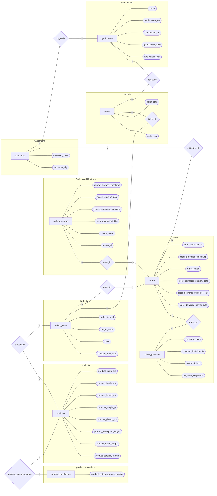

# Tarea 2

A continuación se presenta gráfico entidad relación de la base de datos Brazilian ecommerce.
 
 

 
 

# Dominio de la base de datos

Para una mejor visualización del diagrama entidad-relación, se decido no incluir los dominios dentro del diagrama, a continuación se presentan las tablas que contienen los dominios de cada atributo de la base de datos. Recordando que la manera gráfica de representar los dominios es la siguiente:

 

 

<table>
<tr><th> Customers </th><th>Geolocation</th></tr>
<tr><td>

| Atributo                 | Dominio     |
|--------------------------|-------------|
| customer_id              | VARCHAR(32) |
| customer_unique_id       | VARCHAR(32) |
| customer_zip_code_prefix | VARCHAR(5)  |
| customer_city            | VARCHAR(50) |
| customer_state           | VARCHAR(2)  |

</td><td>

| Atributo                    | Dominio          |
|-----------------------------|------------------|
| geolocation_zip_code_prefix | VARCHAR(5)       |
| geolocation_city            | VARCHAR(50)      |
| geolocation_state           | VARCHAR(2)       |
| geolocation_lat             | double[-90,90]   |
| geolocation_lng             | double[-180,180] |
| geolocation_count           | int[1,999999]    |

</td></tr> </table>

 

<table>
<tr><th> Order_items </th><th>order_payments</th></tr>
<tr><td>

| Atributo            | Dominio                       |
|---------------------|-------------------------------|
| order_id            | VARCHAR(32)                   |
| order_item_id       | int[1,999]                    |
| product_id          | VARCHAR(32)                   |
| seller_id           | VARCHAR(32)                   |
| shipping_limit_date | DATE[01-01-2016 : 31-12-2018] |
| price               | double(0,99999]               |
| freight_value       | double[0,99999]               |
</td><td>

| Atributo             | Dominio         |
|----------------------|-----------------|
| order_id             | VARCHAR(32)     |
| payment_sequential   | int[1,999]      |
| payment_type         | VARCHAR(32)     |
| payment_installments | int[0,999]      |
| payment_value        | double(0,99999] |
</td></tr> </table>

 

<table>
<tr><th>  order_review  </th><th>orders</th></tr>
<tr><td>

| Atributo                | Dominio                           |
|-------------------------|-----------------------------------|
| review_id               | VARCHAR(32)                       |
| order_id                | VARCHAR(32)                       |
| review_score            | int[1,5]                          |
| review_comment_title    | VARCHAR(50)                       |
| review_comment_message  | VARCHAR(500)                      |
| review_creation_date    | DATE[01-01-2016 : 31-12-2018]     |
| review_answer_timestamp | DATETIME[01-01-2016 : 31-12-2018] |

</td><td>

| Atributo                      | Dominio                           |
|-------------------------------|-----------------------------------|
| order_id                      | VARCHAR(32)                       |
| customer_id                   | VARCHAR(32)                       |
| order_status                  | VARCHAR(24)                       |
| order_purchase_timestamp      | DATETIME[01-01-2016 : 31-12-2018] |
| order_approved_at             | DATETIME[01-01-2016 : 31-12-2018] |
| order_delivered_carrier_date  | DATETIME[01-01-2016 : 31-12-2018] |
| order_delivered_customer_date | DATETIME[01-01-2016 : 31-12-2018] |
| order_estimated_delivery_date | DATE[01-01-2016 : 31-12-2018]     |

</td></tr> </table>

 

<table>
<tr><th>  products  </th><th>sellers</th></tr>
<tr><td>

| Atributo                   | Dominio      |
|----------------------------|--------------|
| product_id                 | VARCHAR(32)  |
| product_category_name      | VARCHAR(50)  |
| product_name_lenght        | int[1,999]   |
| product_description_lenght | int[1,9999]  |
| product_photos_qty         | int[1,25]    |
| product_weight_g           | int[1,99999] |
| product_length_cm          | int[1,999]   |
| product_height_cm          | int[1,999]   |
| product_width_cm           | int[1,999]   |

</td><td>

| Atributo               | Dominio     |
|------------------------|-------------|
| seller_id              | VARCHAR(32) |
| seller_zip_code_prefix | VARCHAR(5)  |
| seller_city            | VARCHAR(50) |
| seller_state           | VARCHAR(2)  |

</td></tr> </table>

 

| product_category_name         |             |
|-------------------------------|-------------|
| Atributo                      | Dominio     |
| product_category_name         | VARCHAR(50) |
| product_category_name_english | VARCHAR(50) |

